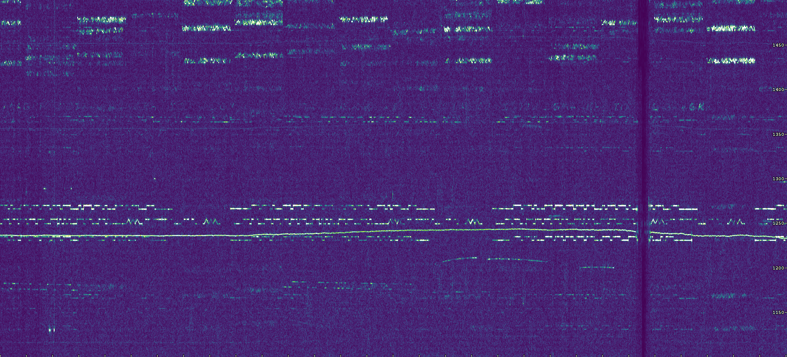

# Spectrogram
**Spectrogram** is a .NET library which makes it easy to create spectrograms from pre-recorded signals or live audio from the sound card. This library supports .NET Framework (4.5) and .NET Core (3.0) and can be installed using [NuGet](https://www.nuget.org/packages/Spectrogram/).


## Quickstart

### Song to Spectrogram
The code below converts a WAV file to a spectrograph and saves it as an image. This code analyzed [Mozart's Piano Sonata No. 11 in A major](https://www.youtube.com/watch?v=aeEmGvm7kDk) to produce the picture above.

```cs
// load audio and process FFT
var spec = new Spectrogram.Spectrogram(sampleRate: 8000, fftSize: 2048, step: 700);
float[] values = Spectrogram.Tools.ReadWav("mozart.wav");
spec.AddExtend(values);

// convert FFT to an image and save it
Bitmap bmp = spec.GetBitmap(intensity: 2, freqHigh: 2500);
spec.SaveBitmap(bmp, "mozart.jpg");
```

### Human Voice
This code analyzes audio from HAL's famous quote, "I'm sorry Dave, I'm afraid I can't do that". The output is can be rendered using different colormaps.

```cs
// load audio and process FFT
var spec = new Spectrogram.Spectrogram(sampleRate: 15000, fftSize: 4096, step: 400);
float[] values = Spectrogram.Tools.ReadMp3("cant-do-that.mp3");
spec.AddExtend(values);

// convert FFT to an image and save it
Bitmap bmp = spec.GetBitmap(intensity: .2, freqHigh: 1000,
    colormap: Spectrogram.Colormap.grayscaleInverted);
spec.SaveBitmap(bmp, "cant-do-that-grayscale-inverted.jpg");
```
colormap | sample output
---|---
**Grayscale Inverted** is used in many scientific publications when analyzing things like human voices and bird sounds|
**Grayscale** provides highest contrast output but does not benefit from color vision|
**Viridis** is the default colormap. It was specifically designed to represent 2D data in a way [ideally suited for human vision](https://www.youtube.com/watch?v=xAoljeRJ3lU).|
**vdGreen** is the default colormap used for [QRSS-VD](https://github.com/swharden/QRSS-VD), a very old software project of mine. |

### QRSS Analysis

Experimenters with ultra-narrowband radio transmissions often use continuous wave  frequency-shifting radio transmitters to send data at very low rates over very long distances using very little power. See [_What is QRSS?_](https://www.qsl.net/m0ayf/What-is-QRSS.html) for more information. 

The following code produces a QRSS spectrogram from an MP3 file. This program took less than 5 seconds to analyze 30 minutes of audio, producing the image below.

```cs
// load audio and process FFT
var spec = new Spectrogram.Spectrogram(sampleRate: 8000, fftSize: 16384, step: 8000);
float[] values = Spectrogram.Tools.ReadMp3("qrss-w4hbk.mp3");
spec.AddExtend(values);

// convert FFT to an image and save it
Bitmap bmp = spec.GetBitmap(intensity: 1.5, freqLow: 1100, freqHigh: 1500,
    showTicks: true, tickSpacingHz: 50, tickSpacingSec: 60);
spec.SaveBitmap(bmp, "qrss.png");
```




## Demo Applications
This project comes with a few interactive applications which serve as useful references for some of the ways this Spectrogram library can be used.

### Download Demo EXE Files
If you want to see what this library can do without downloading source code, click-to-run (EXE) demos are available in **[SpectrogramDemo.zip](/dev/compiled-demos/SpectrogramDemo.zip)**

### Audio Monitor

A demo program is included which monitors the sound card and continuously creates spectrograms from microphone input. It runs fast enough that the entire bitmap can be recreated on each render. This means brightness and color adjustments can be applied to the whole image, not just new parts.


### Waterfall with Graphs
This demo program was created to demonstrate Spectrogram and ScottPlot working together.


## Resources

### Similar Software
* Argo ([website](http://digilander.libero.it/i2phd/argo/)) - closed-source QRSS viewer for Windows
* SpectrumLab ([website](http://www.qsl.net/dl4yhf/spectra1.html)) - closed-source spectrum analyzer for Windows 
* QrssPIG ([GitLab](https://gitlab.com/hb9fxx/qrsspig)) - open-source spectrograph for Raspberry Pi (C++)
* Lopora ([GitHub](https://github.com/swharden/Lopora)) - open-source spectrograph (Python 3) 
* QRSS VD ([GitHub](https://github.com/swharden/QRSS-VD)) - open source spectrograph (Python 2)

### QRSS Information
  * [What is QRSS?](https://www.qsl.net/m0ayf/What-is-QRSS.html)
  * [QRSS and you](http://www.ka7oei.com/qrss1.html)
  * [QRSS (slow CW)](https://sites.google.com/site/qrssinfo/QRSS-Slow-CW)
