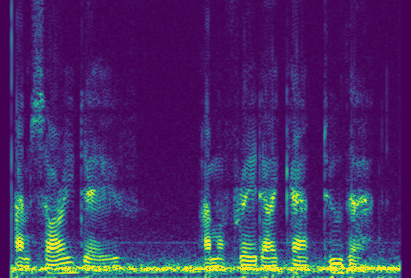
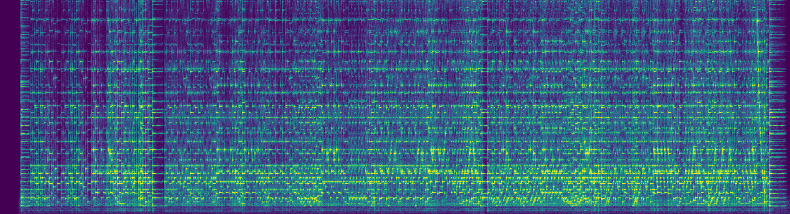
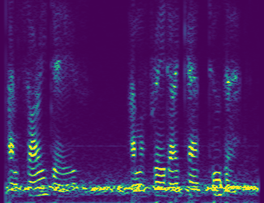
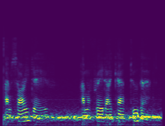

# Spectrogram

[](https://github.com/swharden/Spectrogram/actions/workflows/ci.yaml)
[](https://www.nuget.org/packages/Spectrogram/)

**Spectrogram** is a .NET library for creating spectrograms from pre-recorded signals or live audio from the sound card.  Spectrogram uses FFT algorithms and window functions provided by the [FftSharp](https://github.com/swharden/FftSharp) project, and it targets .NET Standard so it can be used in .NET Framework and .NET Core projects.

<div align="center">



_"I'm sorry Dave... I'm afraid I can't do that"_

</div>


## Quickstart

* This code generates the spectrogram above.

* Source code for the WAV reading method is at the bottom of this page.

```cs
(double[] audio, int sampleRate) = ReadMono("hal.wav");
var sg = new SpectrogramGenerator(sampleRate, fftSize: 4096, stepSize: 500, maxFreq: 3000);
sg.Add(audio);
sg.SaveImage("hal.png");
```


## Windows Forms

If you're using Spectrogram in a graphical application you may find it helpful to retrieve the output as a Bitmap which can be displayed on a Picturebox:

```cs
pictureBox1.Image = sg.GetBitmap();
```

I find it helpful to put the Picturebox inside a Panel with auto-scroll enabled, so large spectrograms which are bigger than the size of the window can be interactively displayed.

## Real-Time Spectrogram

An example program is included in this repository which demonstrates how to use NAudio to get samples from the sound card and display them as a spectrogram. Spectrogram was designed to be able to display spectrograms with live or growing data, so this is exceptionally easy to implement.

* **Click-to-run demo** for 64-bit Windows: [SpectrogramDemo.exe](dev/SpectrogramDemo.zip)


To do this, keep your Spectrogram at the class level:
```cs
SpectrogramGenerator sg;

public Form1()
{
    InitializeComponent();
    sg = new SpectrogramGenerator(sampleRate, fftSize: 4096, stepSize: 500, maxFreq: 3000);
}
```

Whenever an audio buffer gets filled, add the data to your Spectrogram:
```cs
private void GotNewBuffer(double[] audio)
{
    sg.Add(audio);
}
```

Then set up a timer to trigger rendering:
```cs
private void timer1_Tick(object sender, EventArgs e){
    Bitmap bmp = sg.GetBitmap(intensity: .4);
    pictureBox1.Image?.Dispose();
    pictureBox1.Image = bmp;
}
```

Review the source code of the demo application for additional details and considerations. You'll found I abstracted the audio interfacing code into its own class, isolating it from the GUI code.

## Song-to-Spectrogram

This example demonstrates how to convert a MP3 file to a spectrogram image. A sample MP3 audio file in the [data folder](data) contains the audio track from Ken Barker's excellent piano performance of George Frideric Handel's Suite No. 5 in E major for harpsichord ([_The Harmonious Blacksmith_](https://en.wikipedia.org/wiki/The_Harmonious_Blacksmith)). This audio file is included [with permission](dev/Handel%20-%20Air%20and%20Variations.txt), and the [original video can be viewed on YouTube](https://www.youtube.com/watch?v=Mza-xqk770k).

```cs
(double[] audio, int sampleRate) = ReadMono("song.wav");

int fftSize = 16384;
int targetWidthPx = 3000;
int stepSize = audio.Length / targetWidthPx;

var sg = new SpectrogramGenerator(sampleRate, fftSize, stepSize, maxFreq: 2200);
sg.Add(audio);
sg.SaveImage("song.png", intensity: 5, dB: true);
```

Notice the optional conversion to Decibels while saving the image.



If you [listen to the audio track](https://www.youtube.com/watch?v=Mza-xqk770k) while closely inspecting the spectrogram you can identify individual piano notes and chords, and may be surprised by the interesting patterns that emerge around trills and glissandos.

## Spectrogram Information

The Spectrogram's `ToString()` method displays detailed information about the spectrogram:

```cs
Console.WriteLine(sg);
```

```
Spectrogram (2993, 817)
  Vertical (817 px): 0 - 2,199 Hz, FFT size: 16,384 samples, 2.69 Hz/px
  Horizontal (2993 px): 2.96 min, window: 0.37 sec, step: 0.06 sec, overlap: 84%
```

## Colormaps

These examples demonstrate the identical spectrogram analyzed with a variety of different colormaps. Spectrogram colormaps can be changed by calling the `SetColormap()` method:

```cs
(double[] audio, int sampleRate) = ReadMono("hal.wav");
var sg = new SpectrogramGenerator(sampleRate, fftSize: 8192, stepSize: 200, maxFreq: 3000);
sg.Add(audio);
sg.SetColormap(Colormap.Jet);
sg.SaveImage($"jet.png");
```

Viridis | Greens | Blues | Grayscale | GrayscaleR
---|---|---|---|---
||||

## Mel Spectrogram

Analytical spectrograms aimed at achieving maximum frequency resolution are presented using linear scaling, where every row of pixels is evenly spaced in the frequency domain. However, biological sensory systems tend to be logarithmic, and the human ear can differentiate frequency shifts better at lower frequencies than at higher ones. 

**To visualize frequency in a way that mimics human perception** we create a spectrogram that represents lower frequencies using a large portion of the image, and condense higher frequency ranges into smaller rows of pixels toward the top of the image. The [Mel Scale](https://en.wikipedia.org/wiki/Mel_scale) is commonly used to represent power spectral density this way, and the resulting _Mel Spectrogram_ has greatly reduced vertical resolution but is a better representation of human frequency perception. 

Cropped Linear Scale (0-3kHz) | Mel Scale (0-22 kHz)
---|---
|

Amplitude perception in humans, like frequency perception, is logarithmic. Therefore, Mel spectrograms typically display log-transformed spectral power and are presented using Decibel units.

```cs
(double[] audio, int sampleRate) = ReadMono("hal.wav");
var sg = new SpectrogramGenerator(sampleRate, fftSize: 4096, stepSize: 500, maxFreq: 3000);
sg.Add(audio);

// Create a traditional (linear) Spectrogram
sg.SaveImage("hal.png");

// Create a Mel Spectrogram
Bitmap bmp = sg.GetBitmapMel(melSizePoints: 250);
bmp.Save("halMel.png", ImageFormat.Png);
```

## Read Data from an Audio File

You should customize your file-reading method to suit your specific application. I frequently use the NAudio package to read data from WAV and MP3 files. This function reads audio data from a mono WAV file and will be used for the examples on this page.

```cs
(double[] audio, int sampleRate) ReadMono(string filePath, double multiplier = 16_000)
{
    using var afr = new NAudio.Wave.AudioFileReader(filePath);
    int sampleRate = afr.WaveFormat.SampleRate;
    int bytesPerSample = afr.WaveFormat.BitsPerSample / 8;
    int sampleCount = (int)(afr.Length / bytesPerSample);
    int channelCount = afr.WaveFormat.Channels;
    var audio = new List<double>(sampleCount);
    var buffer = new float[sampleRate * channelCount];
    int samplesRead = 0;
    while ((samplesRead = afr.Read(buffer, 0, buffer.Length)) > 0)
        audio.AddRange(buffer.Take(samplesRead).Select(x => x * multiplier));
    return (audio.ToArray(), sampleRate);
}
```