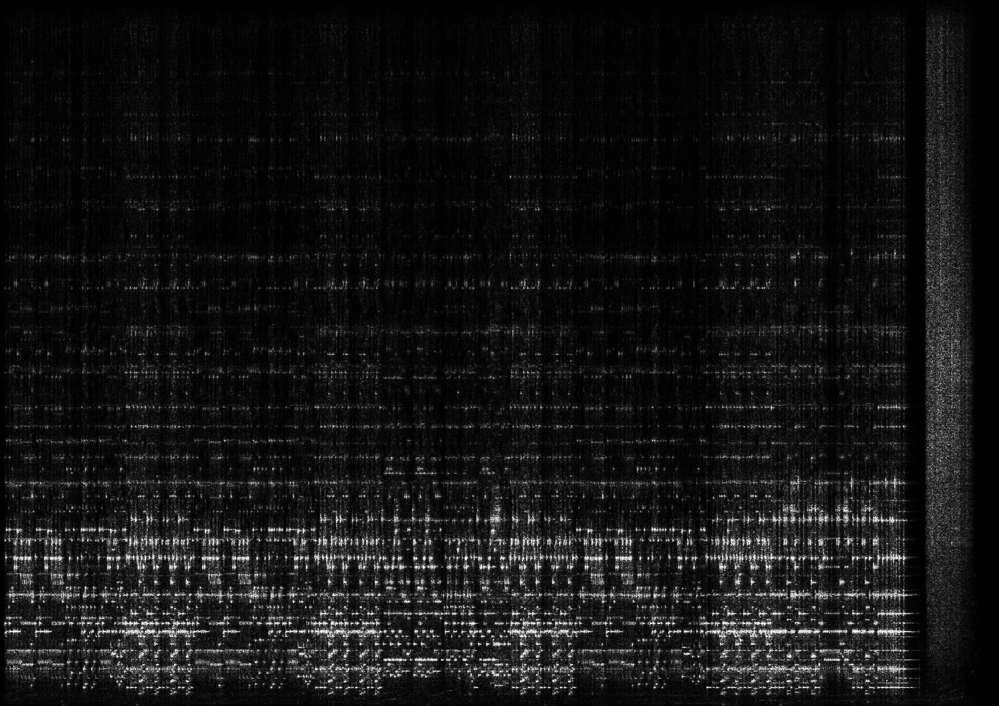

# Spectrogram
.NET library for creating spectrograms

**WARNING: This software project is pre-alpha! This repo is just a place to collect ideas and code.**


## Quickstart

This example converts an entire WAV file to a spectrograph image:

```cs
var spec = new Spectrogram.Spectrogram();
float[] values = Spectrogram.WavFile.Read("mozart.wav");
spec.Add(values);
spec.SaveBitmap("mozart.png");
```

```
Created image (2897 x 2048) in 143.4841 ms
```

The signal ([mozart.wav](/data/mozart.wav)) is 3 minutes long and the vertical axis of the spectrograph spans the full time horizontally and spans spans 0-4 kHz vertically.



## TODO:
* render horizontally or vertically
* optional display of axis labels (scales)
* create bitmaps in real time from audio input
* advanced color (LUT) options
* advanced intensity options (nonlinear scaling)
* create a user control to display a spectrogram
* create a user control to adjust spectrogram settings

## Resources
* [microphone spectrograph in C#](https://github.com/swharden/Csharp-Data-Visualization/tree/master/projects/18-01-11_microphone_spectrograph)
* [QRSS Spectrograph in C#](https://github.com/swharden/Csharp-Data-Visualization/tree/master/projects/18-01-14_qrss)
* [Simulation of QRSS Signals](https://www.qsl.net/pa2ohh/12qrsssim1.htm)

### QRSS

#### Introduction
  * [What is QRSS?](https://www.qsl.net/m0ayf/What-is-QRSS.html)
  * [QRSS and you](http://www.ka7oei.com/qrss1.html)
  * [QRSS (slow CW)](https://sites.google.com/site/qrssinfo/QRSS-Slow-CW)

#### Software
* Argo ([website](http://digilander.libero.it/i2phd/argo/)) - closed-source QRSS viewer for Windows
* SpectrumLab ([website](http://www.qsl.net/dl4yhf/spectra1.html)) - closed-source spectrum analyzer for Windows 
* QrssPIG ([gitlab](https://gitlab.com/hb9fxx/qrsspig)) - open-source spectrograph for Raspberry Pi (C++)
* Lopora ([website](http://www.qsl.net/pa2ohh/11lop.htm)) - open-source spectrograph (Python 3) 
* QRSS VD ([github](https://github.com/swharden/QRSS-VD)) - open source spectrograph (Python 2)

### Spectrogram vs ~~Spectrograph~~
* A spectrogram is an image
* A spectrograph is a machine
* Stop using the word spectrograph in software!