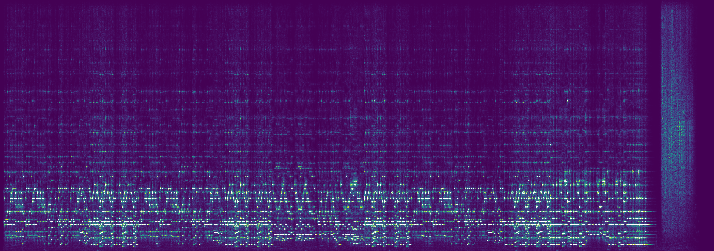
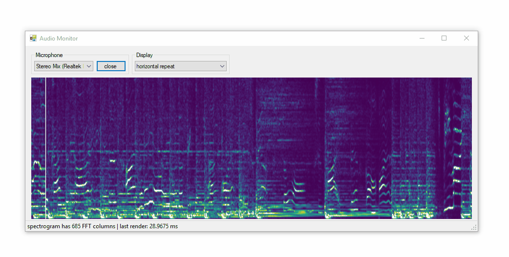
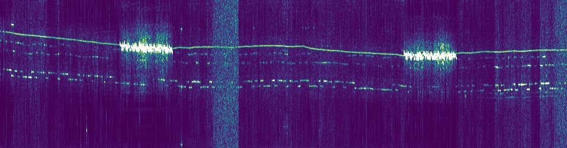

# Spectrogram
**Spectrogram** is a .NET library which makes it easy to create spectrograms from pre-recorded signals or live audio from the sound card. This library supports .NET Framework (4.5) and .NET Core (3.0).



**Quickstart:** The code below converts a WAV file to a spectrograph and saves it as an image. This code analyzed [Mozart's Piano Sonata No. 11 in A major](https://www.youtube.com/watch?v=aeEmGvm7kDk) to produce the picture above.

```cs
var spec = new Spectrogram.Spectrogram(fftSize: 2048);
float[] values = Spectrogram.WavFile.Read("mozart.wav");
spec.Add(values);
spec.SaveImage("mozart.jpg");
```

## Realtime Audio Monitor

A demo program is included which monitors the sound card and continuously creates spectrograms from microphone input. It runs fast enough that the entire bitmap can be recreated on each render. This means brightness and color adjustments can be applied to the whole image, not just new parts.



This demo is available as a click-to-run EXE in [/dev/compiled-demos/](/dev/compiled-demos/)

## QRSS Spectrograph

This library may be useful for displaying QRSS signals. I added some QRSS audio to the [/data](/data) folder to practice analyzing.



The image above is from 10 minutes of audio processed by the program below. The entire program took less than 2 seconds to run.

```cs
var spec = new Spectrogram.Spectrogram(
    fftSize: 8192, 
    stepSize: 5000,
    intensity: 2, 
    pixelLower: 1250, 
    pixelUpper: 1500
    );
    
float[] values = Spectrogram.WavFile.Read("qrss.wav");
spec.Add(values);
spec.SaveImage("qrss.jpg");
```

#### New to QRSS?
  * [What is QRSS?](https://www.qsl.net/m0ayf/What-is-QRSS.html)
  * [QRSS and you](http://www.ka7oei.com/qrss1.html)
  * [QRSS (slow CW)](https://sites.google.com/site/qrssinfo/QRSS-Slow-CW)

## Waterfall
This demo program was created to demonstrate Spectrogram and ScottPlot working together.


## Developer Notes

This project is still a work in progress.


### TODO:
* ~~render horizontally or vertically~~
* ~~create bitmaps in real time from audio input~~
* ~~advanced color (LUT) options~~
* ~~advanced intensity options (nonlinear scaling)~~
* create a user control to display a spectrogram
* create a user control to adjust spectrogram settings
* ~~options for bitmap to scroll or to statically repeat~~
* create a way to convert between frequency and pixel position
* optional display of axis labels (scales with ticks)

### Similar Software
* Argo ([website](http://digilander.libero.it/i2phd/argo/)) - closed-source QRSS viewer for Windows
* SpectrumLab ([website](http://www.qsl.net/dl4yhf/spectra1.html)) - closed-source spectrum analyzer for Windows 
* QrssPIG ([GitLab](https://gitlab.com/hb9fxx/qrsspig)) - open-source spectrograph for Raspberry Pi (C++)
* Lopora ([website](http://www.qsl.net/pa2ohh/11lop.htm)) - open-source spectrograph (Python 3) 
* QRSS VD ([GitHub](https://github.com/swharden/QRSS-VD)) - open source spectrograph (Python 2)

### Spectrogram vs ~~Spectrograph~~
* A spectrogram is an image
* A spectrograph is a machine
* Stop using the word spectrograph in software!
