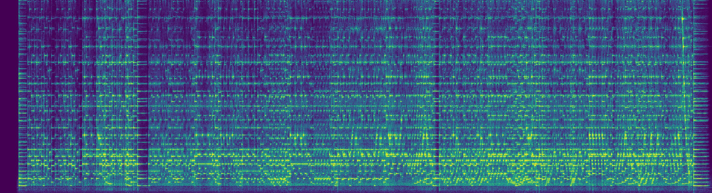
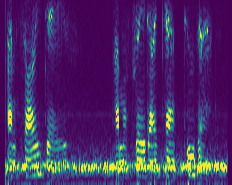
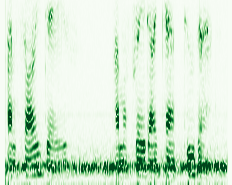
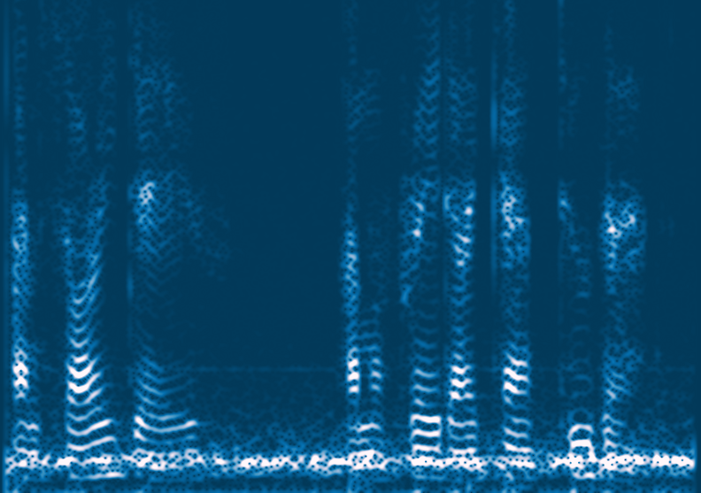
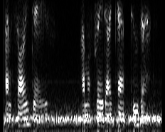
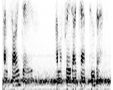
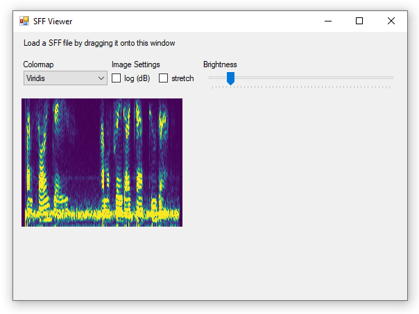
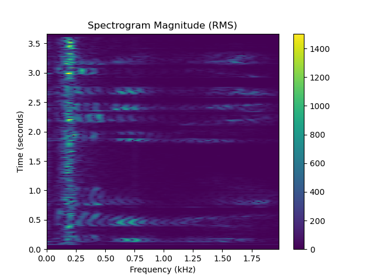
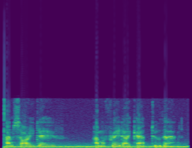

# Spectrogram

[](https://dev.azure.com/swharden/swharden/_build/latest?definitionId=9&branchName=master)
[](https://www.nuget.org/packages/Spectrogram/)

**Spectrogram** is a .NET library for creating spectrograms from pre-recorded signals or live audio from the sound card.  Spectrogram uses FFT algorithms and window functions provided by the [FftSharp](https://github.com/swharden/FftSharp) project, and it targets .NET Standard 2.0 so it can be used in .NET Framework and .NET Core projects.

<div align="center">


_"I'm sorry Dave... I'm afraid I can't do that"_

</div>


## Quickstart

_Spectrogram is [available on NuGet](https://www.nuget.org/packages/Spectrogram)_

```cs
(int sampleRate, double[] audio) = WavFile.ReadMono("hal.wav");

var spec = new Spectrogram(sampleRate, fftSize: 4096, stepSize: 500, maxFreq: 3000);
spec.Add(audio);
spec.SaveImage("hal.png", intensity: .4);
```

This code generates the image displayed at the top of this page.

## Windows Forms

If you're using Spectrogram in a graphical application you may find it helpful to retrieve the output as a Bitmap which can be displayed on a Picturebox:

```cs
Bitmap bmp = spec.GetBitmap();
pictureBox1.Image = bmp;
```

I find it helpful to put the Picturebox inside a Panel with auto-scroll enabled, so large spectrograms which are bigger than the size of the window can be interactively displayed.

## Real-Time Spectrogram

An example program is included in this repository which demonstrates how to use [NAudio](https://github.com/naudio/NAudio) to get samples from the sound card and display them as a spectrogram. Spectrogram was designed to be able to display spectrograms with live or growing data, so this is exceptionally easy to implement.


To do this, keep your Spectrogram at the class level:
```cs
Spectrogram spec;

public Form1()
{
    InitializeComponent();
    spec = new Spectrogram(sampleRate, fftSize: 4096, stepSize: 500, maxFreq: 3000);
}
```

Whenever an audio buffer gets filled, add the data to your Spectrogram:
```cs
private void GotNewBuffer(double[] audio)
{
    spec.Add(audio);
}
```

Then set up a timer to trigger rendering:
```cs
private void timer1_Tick(object sender, EventArgs e){
    Bitmap bmp = spec.GetBitmap(intensity: .4);
    pictureBox1.Image?.Dispose();
    pictureBox1.Image = bmp;
}
```

Review the source code of the demo application for additional details and considerations. You'll found I abstracted the audio interfacing code into its own class, isolating it from the GUI code.

## Song-to-Spectrogram

This example demonstrates how to convert a MP3 file to a spectrogram image. A sample MP3 audio file in the [data folder](data) contains the audio track from Ken Barker's excellent piano performance of George Frideric Handel's Suite No. 5 in E major for harpsichord ([_The Harmonious Blacksmith_](https://en.wikipedia.org/wiki/The_Harmonious_Blacksmith)). This audio file is included [with permission](dev/Handel%20-%20Air%20and%20Variations.txt), and the [original video can be viewed on YouTube](https://www.youtube.com/watch?v=Mza-xqk770k).

```cs
(int sampleRate, double[] audio) = WavFile.ReadMono("Handel.wav");

var spec = new Spectrogram(sampleRate, fftSize: 16384, stepSize: 2500, maxFreq: 2200);
spec.Add(audio);
spec.SaveImage("spectrogram-song.jpg", intensity: 5, dB: true);
```

Notice the optional conversion to Decibels while saving the image.



If you [listen to the audio track](https://www.youtube.com/watch?v=Mza-xqk770k) while closely inspecting the spectrogram you can identify individual piano notes and chords, and may be surprised by the interesting patterns that emerge around trills and glissandos.

## Spectrogram Information

The Spectrogram's `ToString()` method displays detailed information about the spectrogram:

```cs
Console.WriteLine(spec);
```

```
Spectrogram (2993, 817)
  Vertical (817 px): 0 - 2,199 Hz, FFT size: 16,384 samples, 2.69 Hz/px
  Horizontal (2993 px): 2.96 min, window: 0.37 sec, step: 0.06 sec, overlap: 84%
```

## Colormaps

These examples demonstrate the identical spectrogram analyzed with a variety of different colormaps. Spectrogram colormaps can be changed by calling the `SetColormap()` method:

```cs
(int sampleRate, double[] audio) = WavFile.ReadMono("hal.wav");
int fftSize = 8192;
var spec = new Spectrogram(sampleRate, fftSize, stepSize: 200, maxFreq: 3000);
spec.Add(audio);
spec.SetColormap(Colormap.Jet);
spec.SaveImage($"hal-Jet.png", intensity: .5);
```

Viridis | Greens | Blues | Grayscale | GrayscaleR
---|---|---|---|---
||||

## Spectrogram File Format (SFF)

The Spectrogram library has methods which can read and write SFF files, a file format specifically designed for storing spectrogram data. SFF files contain 2D spectrogram data (repeated FFTs) with a [small header](dev/sff) describing the audio and FFT settings suitable for deriving scale information. 

SFF files store `double` values (8-byte floating-point data) which is far superior to saving spectrograms as indexed color images (which represent intensity with a single `byte` per pixel).

SFF files be saved using `Complex` data format (with real and imaginary values for each point) to faithfully represent the FFT output, or `double` format to represent magnitude (with an optional pre-conversion to Decibels to represent power). 

### Create SFF Files with C#

This example creates a spectrogram but saves it using the SFF file format instead of saving it as an image. The SFF file can then be read in any language.

```cs
(int sampleRate, double[] audio) = WavFile.ReadMono("hal.wav");
int fftSize = 1 << 12;
var spec = new Spectrogram(sampleRate, fftSize, stepSize: 700, maxFreq: 2000);
spec.Add(audio);
spec.SaveData("hal.sff");
```

### Display SFF Files with C#
Spectrogram data can be loaded from SFF files to facilitate rapid recall of data which can otherwise be resource-intensive to calculate. Spectrogram's `SFF` module facilitates this operation and has methods which can directly convert spectrograms to Bitmaps with options to customize the colormap, intensity, and Decibel scaling.



A simple SFF file viewer has been added to [dev/sff](dev/sff) and serves as a demonstration of how the `SFF` module can be used to generate spectrogram images from SFF files.

### Read SFF Files with Python
A Python module to read SFF files has been created (in [dev/sff](dev/sff)) which allows Spectrograms created by this library and stored in SFF format to be loaded as 2D numpy arrays in Python. 

This example demonstrates how the SFF file created in the previous C# example can be loaded into Python and displayed with matplotlib. This example has a few lines related to styling omitted for brevity, but the full Python demo can be found in [dev/sff](dev/sff).

```python
import matplotlib.pyplot as plt
import sffLib

# load spectrogram data as a 2D numpy array
sf = sffLib.SpectrogramFile("hal.sff")

# display the spectrogram as a pseudocolor mesh 
plt.pcolormesh(freqs, times, sf.values)
plt.colorbar()
plt.show()
```



## Mel Spectrogram

Analytical spectrograms aimed at achieving maximum frequency resolution are presented using linear scaling, where every row of pixels is evenly spaced in the frequency domain. However, biological sensory systems tend to be logarithmic, and the human ear can differentiate frequency shifts better at lower frequencies than at higher ones. 

**To visualize frequency in a way that mimics human perception** we create a spectrogram that represents lower frequencies using a large portion of the image, and condense higher frequency ranges into smaller rows of pixels toward the top of the image. The [Mel Scale](https://en.wikipedia.org/wiki/Mel_scale) is commonly used to represent power spectral density this way, and the resulting _Mel Spectrogram_ has greatly reduced vertical resolution but is a better representation of human frequency perception. 

Cropped Linear Scale (0-1kHz) | Full Linear Scale (0-22 kHz) | Mel Scale (0-22 kHz)
---|---|---
||

Amplitude perception in humans, like frequency perception, is logarithmic. Therefore, Mel spectrograms typically display log-transformed spectral power and are presented using Decibel units.

```cs
// Load "I'm sorry dave, I'm afraid I can't do that" audio
(int sampleRate, double[] audio) = WavFile.ReadMono("hal.wav");

// Create a traditional (linear) Spectrogram with dB units
var spec = new Spectrogram(sampleRate, fftSize: 4096, stepSize: 500, maxFreq: 3000);
spec.Add(audio);
spec.SaveImage("hal.png", intensity: 4, dB: true);

// Create a Mel Spectrogram with dB units
Bitmap bmp = spec.GetBitmapMel(melSizePoints: 250, intensity: 4, dB: true);
bmp.Save("halMel.png", ImageFormat.Png);
```

## Resources
* [FftSharp](https://github.com/swharden/FftSharp) - the module which actually performs the FFT and related transformations
* [MP3Sharp](https://github.com/ZaneDubya/MP3Sharp) - a library I use to read MP3 files during testing
* [FSKview](https://github.com/swharden/FSKview) - a real-time spectrogram for viewing frequency-shift-keyed (FSK) signals from audio transmitted over radio frequency.
* [NAudio](https://github.com/naudio/NAudio) - an open source .NET library which makes it easy to get samples from the microphone or sound card in real time