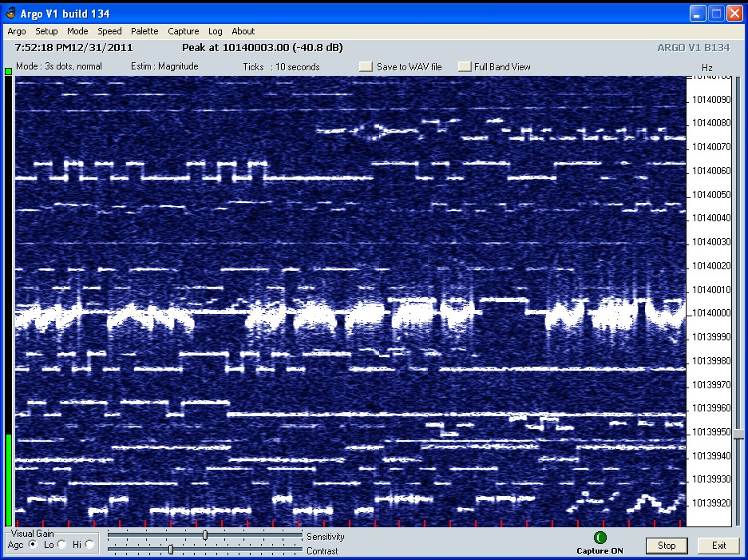

# QRSS Viewer

This is just me thinking out loud what I want to develop. It's essentially an open-source Argo.

### What to Display
* spectrogram and scale
* level meter
* time and date
* latest image save enabled
* image series save enabled
* FTP upload enabled

### Configuration
* vertical ticks
* intensity
  * log or linear
  * automatic (timer)
* sound card

### Intentional Constraints
* width 1000px
